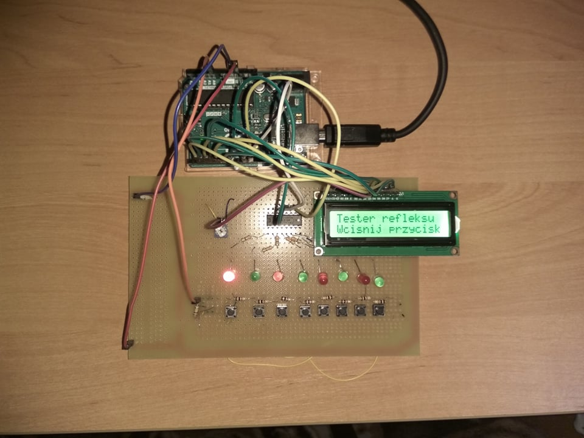

# Reflex-Tester
Program for reflex tester made on adruino. Project was built with arduino uno, shift register, LCD, 8 leds and 8 buttons. It measure time that player needs to react on respectively ligthing dios by pushing right button. It has 3 levels that you can reach by your time: poziom ROBERT, ŚREDNIAK, EMERYT.

